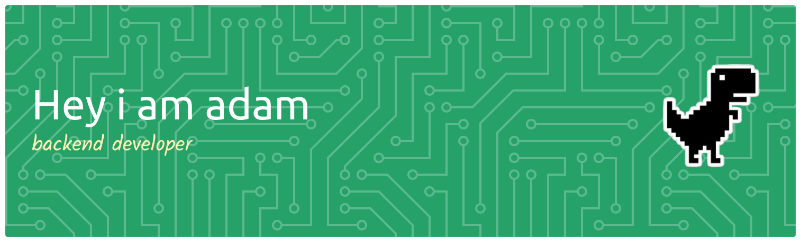

## Hi there 👋

# 💫 About Me:
I’m a backend-focused web developer who enjoys building clean, reliable, and efficient web apps. I work mainly with Node.js and Express, creating APIs and server-side logic that just work.  I’m comfortable using HTML, CSS, and EJS when I need to handle the frontend side too. Right now, I’m using MongoDB for my projects and learning TypeScript and PostgreSQL to level up my backend skills.  I like writing clear code, improving how things work behind the scenes, and learning new tools that make development smoother.

## 🌐 Socials:
   

# 💻 Tech Stack:
            
# 📊 GitHub Stats:
 
 

---

<!-- Proudly created with GPRM ( https://gprm.itsvg.in ) -->

